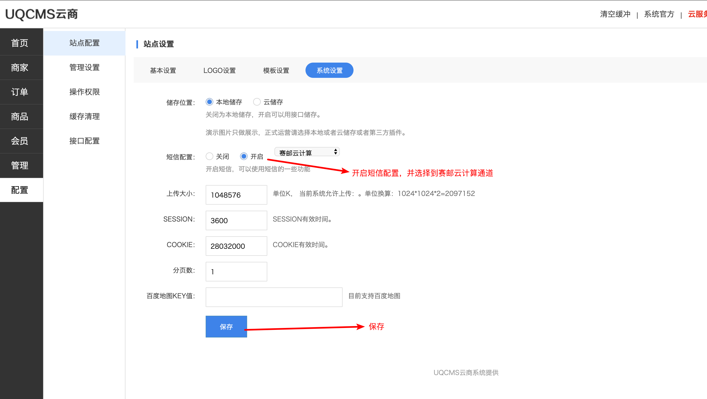
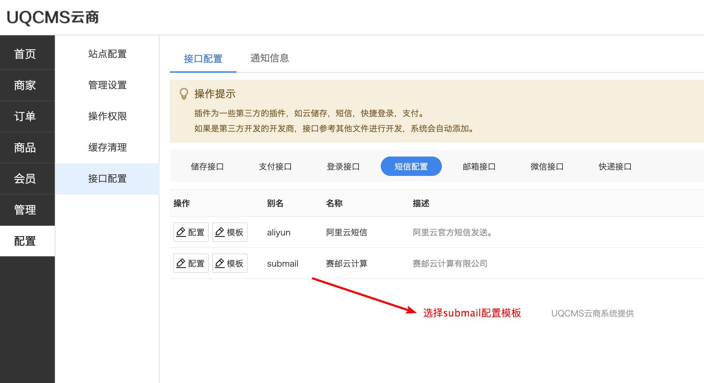
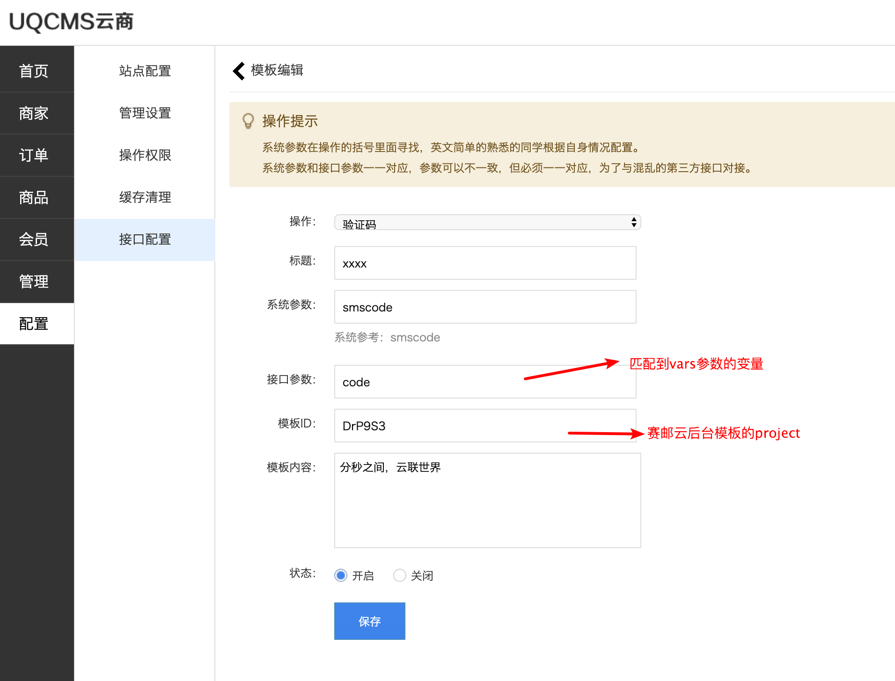
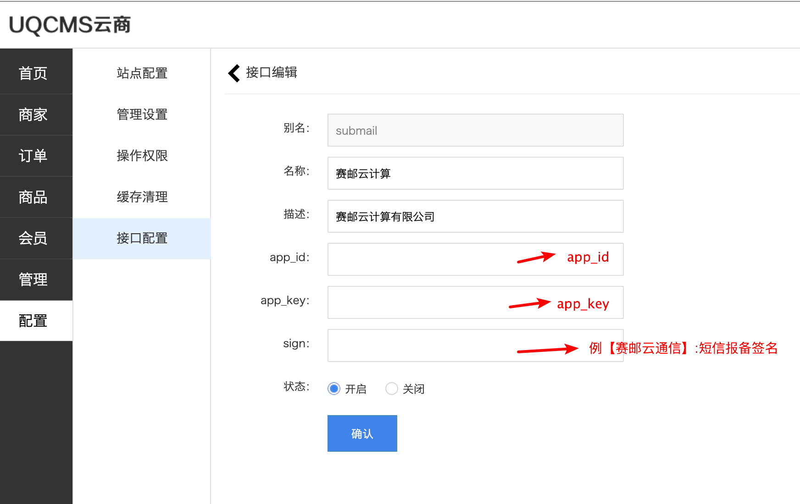

## OVERVIEW

### UQCMS Plug-Ins Overview

------

How to use

使用方法
    添加submail sql:    /admin/controls/submail.class.php
    添加Submail sms-sdk:    /UQframework/api/sms_submail.class.php
登录后台管理界面

[点击下载](https://github.com/submail-developers/uqcms_sms/archive/master.zip)
